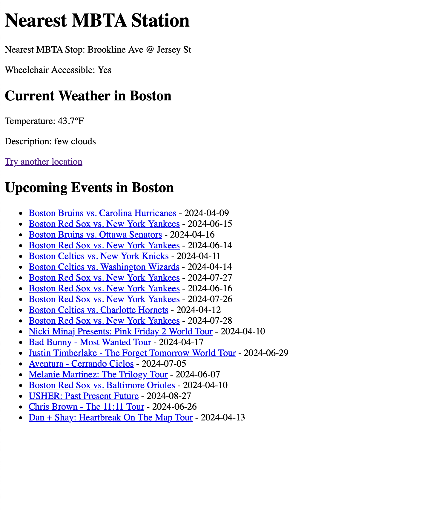

# WebApp-MBTA
 This is the base repository for Web App Developement project. Please read [instructions](instructions.md). 
 The only person working on this project is Adrien Schaal

## Project Overview

This project is a Flask-based web application designed to enhance the commuting experience in the Boston area by providing users with MBTA station information, weather updates, and local event recommendations. Utilizing APIs from OpenWeatherMap for weather forecasts and Ticketmaster for event listings, the app aims to offer a comprehensive guide for residents planning their commute.

## Reflection

### Process

The development process of our project presented both challenges and rewarding moments. Initially, I faced difficulties with API integration, particularly in displaying the data correctly. However, through persistent testing and debugging, I managed to achieve functionality. One area I identified for improvement was my making the interface more user-friendly. 

In terms of testing, adopting a more systematic approach by implementing print statements early on would have allowed me to catch bugs more efficiently. 

### Learning and Development

Throughout this project, I gained invaluable experience in web development, API usage, and the practical application of Python programming. The process of troubleshooting and resolving issues enhanced my problem-solving skills and deepened my understanding of web application architecture.

ChatGPT was quite helpful in overcoming technical hurdles, providing code snippets, and offering explanations for complex concepts, which helped my learning and development process. One lesson I learned was the importance of clear and precise questioning when seeking help from AI tools to obtain the most relevant and useful guidance.

Looking forward, I plan to apply the knowledge and skills acquired from this project to future endeavors, with a particular interest in exploring more advanced web development applications and deeper API integrations.

